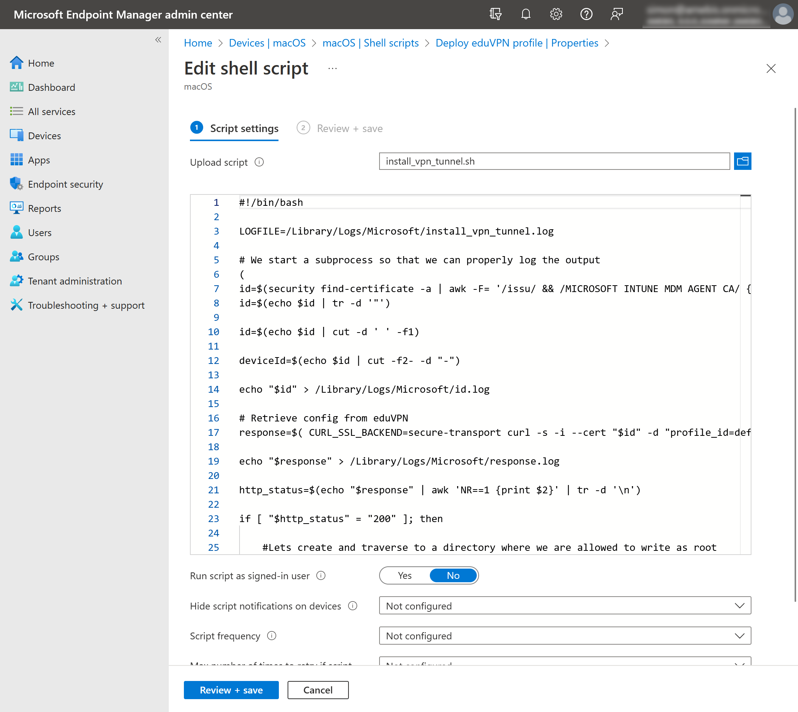

# Provisioning Always-on VPN with Microsoft Intune

This document provides sample instructions, how to deploy always-on VPN
within your organization using Microsoft Intune.

**NOTE**: This is only a suggestion. Your preferred deployment may differ.

This procedure was developed based on the
[HTTP_provisioning](https://github.com/FlorisHendriks98/HTTP_provisioning)
case study.

# Requirements

- [Debian or Fedora v3 eduVPN server with the admin API enabled](ADMIN_API.md)

- An intermediate Debian or Fedora server to handle Microsoft Intune and
  eduVPN interoperability - may run on the same computer as eduVPN server;
  However, it requires separate working DNS entry, e.g. 
  `intermediate.example.org`.

- License for Microsoft Intune

# Installation

## Step 1: Register an Application in Azure

First, we need to register the intermediate server application in Azure. 
This will allow intermediate server to do API calls to Azure.

- Register an app with Azure AD
  [here](https://portal.azure.com/#view/Microsoft_AAD_IAM/ActiveDirectoryMenuBlade/~/RegisteredApps).
  Complete tutorial is available
  [here](https://docs.microsoft.com/en-us/power-apps/developer/data-platform/walkthrough-register-app-azure-active-directory).

- Go to _API permissions_ and add the _Application permissions_ (not the
  _Delegated permissions_) for the _Microsoft Graph_ API:

  - _DeviceManagementManagedDevices.Read.All_
  - _DeviceManagementManagedDevices.ReadWrite.All_

  

  Afterwards, grant admin consent.

- Go to _Certificates & secrets_ and create a new client secret. Save the
  secret value before it disappears. Also, note the date the secret expires.

  

## Step 2: Install Intermediate Server

Intermediate server is a web-server accepting management script profile
requests. It validates requesting device is enrolled in our Azure tenant
and returns WireGuard profile configuration obtained from eduVPN server.

Perform these steps on the server which will host intermediate server:

```bash
$ git clone https://github.com/Amebis/HTTP_provisioning
$ cd HTTP_provisioning/resources/
$ sudo ./deploy_intermediate_debian.sh
```

Replace the last line with `sudo ./deploy_intermediate_fedora.sh`, if your
server is Fedora/RHEL.

The script will ask to enter required information in order to set everything
up properly. Information entered will be saved allowing you to re-run `sudo
./deploy_intermediate_debian.sh` at a later time if reconfiguration is
required. E.g. Before API secret created in Step 1 expires, and we want to
replace it by a new one.

Intermediate server keeps track of Azure enrolled devices periodically.
Should you delete a device from Azure, intermediate server would also delete
that device configuration from the eduVPN server. This is logged in
'/var/lib/vpn-provisioning/revocation.log'.

## Step 3: Configure Always-on eduVPN Profile

Decide and configure a profile on eduVPN server you intend enrolled devices
to use as always-on VPN. Here are some general information to help you plan
your deployment:

### Default Gateway vs. Split Tunnel

For Azure managed devices using always-on VPN with `defaultGateway` has the
following limitations:

- Other VPN clients (e.g. run by user) functionality is greatly reduced to a
  point of not connecting at all.

- The traffic to Microsoft Azure and the intermediate server will also be
  tunneled. In case the VPN tunnel does not work properly (e.g. expires,
  DNS problems etc.), you will not be able to deploy a fix remotely. 
  Devices will require manual intervention to restore networking.

When user VPN is also required, the only working solution is both VPNs are
split-tunnel.

### Profile Expiration

eduVPN servers default session expiration is 90 days (See `sessionExpiry` in
`/etc/vpn-user-portal/config.php`). The deployment scenario, this document
is describing, uses a one-time VPN profile deployment. Either increase
`sessionExpiry` dramatically, or make sure you redeploy the management
scripts before the deadline.

## Step 4: Generate Management Scripts

Open up a browser and visit
`https://intermediate.example.org/management_script/` (replace hostname with
your intermediate server FQDN) to generate `Install-VPN-Tunnel.ps1` and
`install_vpn_tunnel.sh` management scripts.

- `Install-VPN-Tunnel.ps1` is for Windows devices;
- `install_vpn_tunnel.sh` is for macOS devices.

Management scripts contain intermediate server URL and eduVPN profile.
Should either of those change, repeat the procedure from this step onward.


## Step 5: Deploy Management Scripts

Publish the `Install-VPN-Tunnel.ps1` and `install_vpn_tunnel.sh` using Intune.

- `Install-VPN-Tunnel.ps1` goes
  [here](https://endpoint.microsoft.com/#view/Microsoft_Intune_DeviceSettings/DevicesWindowsMenu/~/powershell).

  - Make sure that you configure the Windows PowerShell script to run in
    system context (i.e.  _Run this script using the logged on credentials_
    is set to _No_);
  - and run in a 64 bit PowerShell host (i.e. _Run script in 64 bit
    PowerShell Host_ is set to _Yes_).

  

- `install_vpn_tunnel.sh` goes
  [here](https://endpoint.microsoft.com/#view/Microsoft_Intune_DeviceSettings/DevicesMacOsMenu/~/shellScripts).

  - Make sure that you configure the Bash script to run as root (i.e. _Run
    script as signed-in user_ is set to _No_);

  

The scripts are pushed to the devices and will deploy the always-on VPN.

Should eduVPN profile configuration change or expire, redeploy the
management scripts.

If some things do not go as planned, management scripts report errors in a
log:

- On Windows devices, it is written to
  `C:\Windows\Temp\Install-VPN-Tunnel.log`

- On macOS devices, it is written to
  `/Library/Logs/Microsoft/install_vpn_tunnel.log`

Uninstall management scripts may also be deployed in the same manner to
selected devices. They will remove the VPN tunnel and uninstall WireGuard.

# TODO

- Move intermediate server installation to this repository, once it is
  stable.
- WinGet call in Install-VPN-Tunnel.ps1 fails immediately after vc_redist is
  installed. The script must be deployed for the second time to make it
  succeed.
